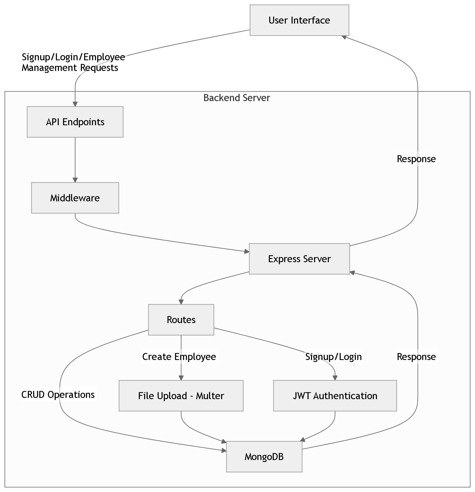

# MERN Machine Test 🚀  

Welcome to the **MERN Machine Test** repository! This project demonstrates a streamlined implementation of the **MERN stack** (MongoDB, Express.js, React.js, and Node.js) to solve a given problem or build a specific application.  

Dive in to explore a clean, modular, and efficient codebase designed for ease of use and adaptability.  

---

## 🛠️ Tech Stack  

This project is built using:  

- **MongoDB**: For the database, enabling seamless data storage and retrieval.  
- **Express.js**: Backend framework for handling routes and server-side logic.  
- **React.js**: Frontend library for building a dynamic and interactive UI.  
- **Node.js**: Runtime environment for executing server-side JavaScript.  

---

## 📁 Folder Structure  

The repository is organized as follows:  

```plaintext
MERN-MACHINE-TEST/
├── client/             # React frontend
│   ├── src/            # Source files
│   ├── public/         # Public assets
├── server/             # Node.js + Express backend
│   ├── routes/         # API route handlers
│   ├── models/         # Database schemas
│   ├── controllers/    # Business logic and API functions
├── .env.example        # Example environment variables
├── package.json        # Project dependencies and scripts
├── README.md           # Project documentation
```

---

## 🚀 Getting Started  

Follow these instructions to set up the project locally:  

### Prerequisites  

Ensure you have the following installed:  

- [Node.js](https://nodejs.org/)  
- [MongoDB](https://www.mongodb.com/)  
- [npm](https://www.npmjs.com/) or [yarn](https://yarnpkg.com/)  

### Installation  

1. **Clone the repository**:  
   ```bash
   git clone https://github.com/bharathsindhe03/MERN-MACHINE-TEST.git
   cd MERN-MACHINE-TEST
   ```  

2. **Set up the backend**:  
   ```bash
   cd server
   npm install
   npx nodemon server.js
   ```  

3. **Set up the frontend**:  
   ```bash
   cd ../client
   npm install
   npm run dev
   ```  

4. Open your browser and navigate to:  
   ```
   http://localhost:3000
   ```

---

## 🌟 Features  

- **Modular Code Structure**: Easy to extend and maintain.  
- **RESTful APIs**: Clean and efficient endpoints for data handling.  
- **Interactive Frontend**: React-powered, user-friendly interface.  
- **Database Integration**: MongoDB with Mongoose for seamless operations.  

---

## 📊 Workflow Diagram  

Below is the workflow diagram representing the architecture of this MERN stack application:  

  

---

### Email Us:
<ul>
  <li>
    <a href='mailto:sindhebharath10@gmail.com'>sindhebharath10@gmail.com</a>
  </li>
  
</ul>

---
## Author
  ### Connect with us on LinkedIn to explore collaboration opportunities for projects and work
 - [Bharath R Sindhe](https://www.linkedin.com/in/bharathsindhe03/)

 
 ---
